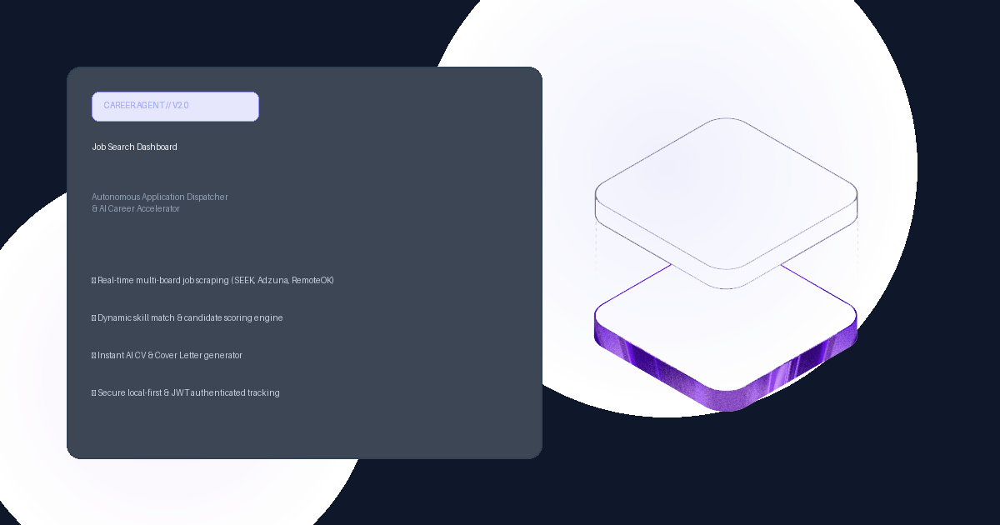

# Job Search Dashboard

An AI-powered job application tracking system that organizes your applications into a sleek Kanban board, surfaces market intelligence, and uses generative AI to tailor resumes and cover letters in one click.



## Live Demo
Check out the live deployment (with Guest Mode enabled): [https://job-dashboard-6xrdvjlrcq-ts.a.run.app/](https://job-dashboard-6xrdvjlrcq-ts.a.run.app/)

## Try it out (Demo Mode)
You don't need a real account to test the waters. When you visit the site, click **Guest / Demo Login** on the login screen, select an industry persona, and you'll instantly have a populated dashboard with realistic mocked data to explore the features.

## Local Setup

This project uses a companion Python backend scraper (`job-dashboard-modular`) for live job fetching and ML scoring. By default in development, it expects that backend to be running locally.

1. **Install dependencies:**
   ```bash
   npm install
   ```

2. **Environment Variables:**
   Create a `.env` file in this directory with any local overrides:
   ```env
   # Set this if you want to use a real Google Sheet as a data source locally instead of the demo payload
   VITE_PERSONAL_SHEET_URL="https://docs.google.com/spreadsheets/d/YOUR_SHEET_ID/export?format=csv"
   VITE_PERSONAL_SHEET_ID="YOUR_SHEET_ID"
   ```

3. **Start the Frontend:**
   ```bash
   npm run dev
   ```

4. **Start the Backend (Optional but recommended):**
   Navigate to the `job-dashboard-modular` directory and start the FastAPI server:
   ```bash
   python3 -m uvicorn src.job_dashboard.run_server:app --reload --port 8000
   ```

## Architecture
- **Frontend:** React 19, Vite, Tailwind CSS, Lucide Icons, DnD Kit (Kanban), Recharts.
- **Backend Auth & Data:** FastAPI Python backend for session management, OAuth simulation, and Web Scraping.
